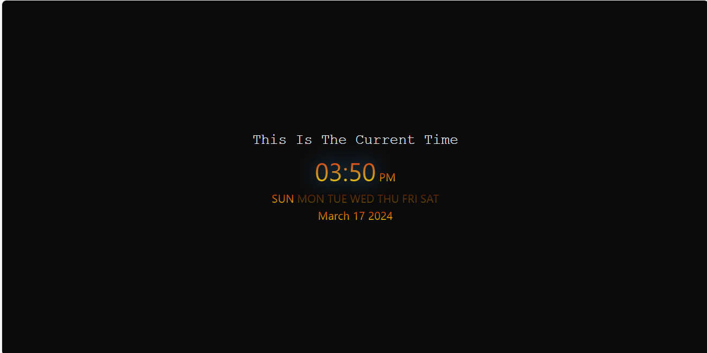

# Web-Programming

This branch contains four tasks completed as part of a personal learning journey.

## Task 1: Portfolio

In this task, I created a personal portfolio to showcase my skills, projects, and experiences. The portfolio includes sections such as:
- About Me
- Skills
- Projects
- Contact Information

()

## Task 2: Weather App

In the second task, I developed a Weather App using an API to retrieve real-time weather data. The app allows users to:
- Enter a location
- Retrieve current weather conditions (temperature, humidity, etc.)
- Display weather forecasts for upcoming days

## Task 3: Digital Clock

For this task, I created a Digital Clock application using HTML, CSS, and JavaScript. The Digital Clock:
- Displays current time (hours, minutes, seconds)
- Updates in real-time without page refresh
- Features a clean and intuitive user interface

## Task 4: Rock Paper Scissors Game

In the fourth task, I developed a simple Rock Paper Scissors game using HTML, CSS, and JavaScript. The game allows users to:
- Choose Rock, Paper, or Scissors
- Compete against the computer's choice
- Determine the winner based on traditional rules

