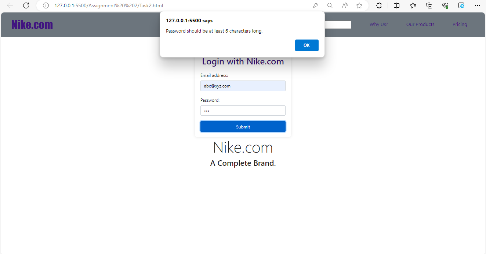
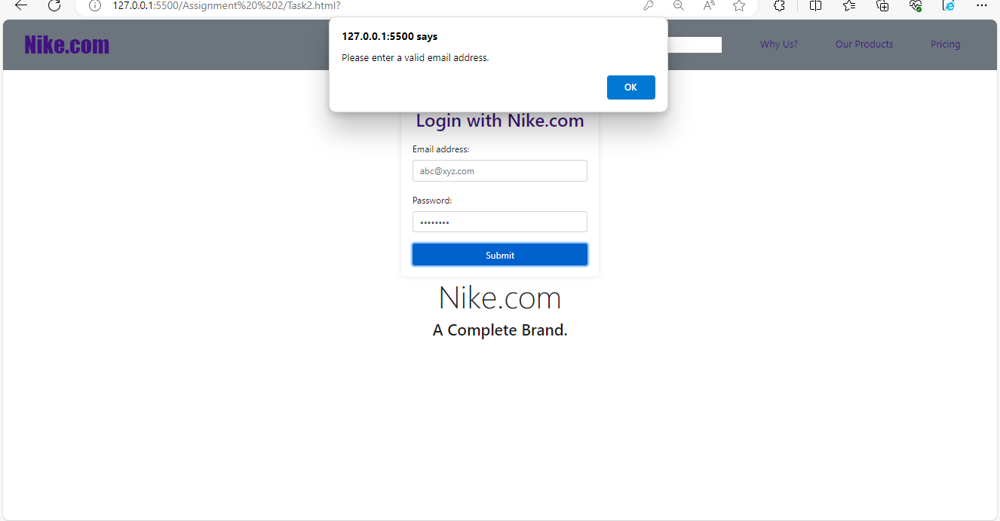
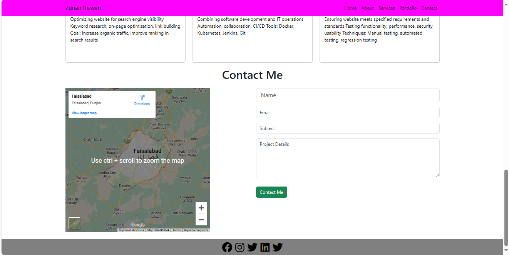
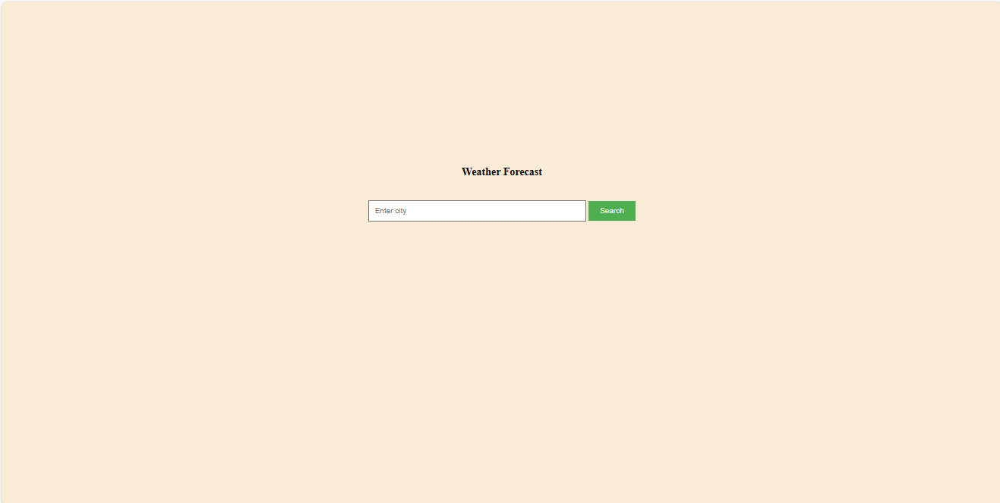
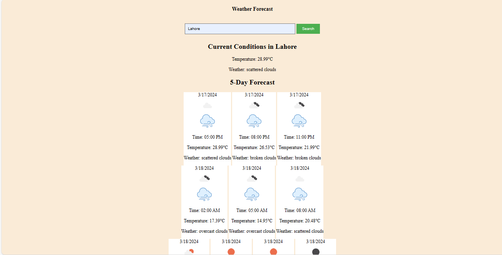
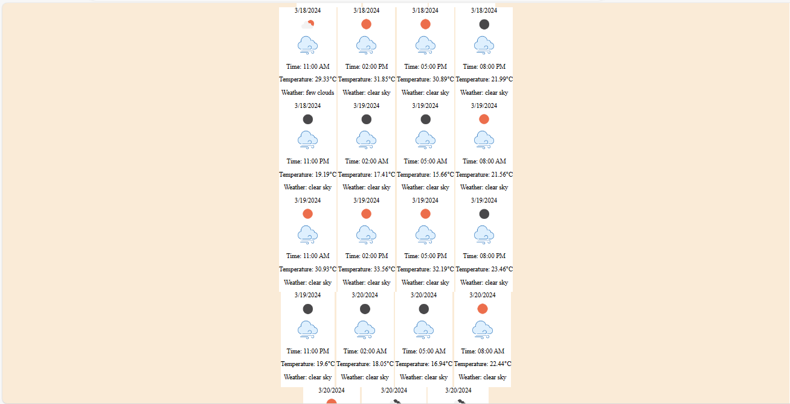

# Web Programming Assignment 2

## Task 2: Form Validation with JavaScript

### Sign-in Form
- Each field is validated for required input.
- Password is validated for length and format.
- Email is validated for format.
- Error messages are displayed for each field.

### Sign-up Form
- Each field is validated for required input.
- Password is validated for length and format.
- Email is validated for format.
- Error messages are displayed for each field.
- Also moving to signin page after signup

### Testing
- Both forms are thoroughly tested for validation.
- Various input scenarios are tested to ensure proper validation.

## Task 3: Bootstrap Practice

### Image Fluidity
- Three images are displayed in a row using Bootstrap's grid system.
- Images are made fluid to maintain aspect ratio.

## After clicking button 
